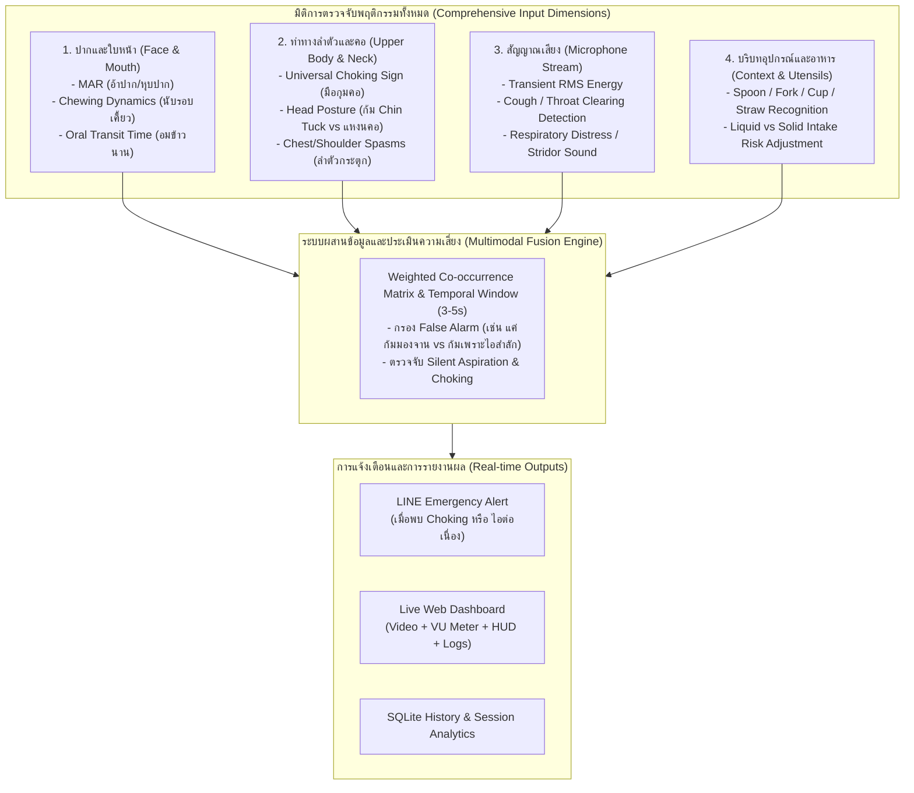

# 🗺️ SwallowSense: แผนการพัฒนาระบบตรวจจับการกลืนและการสำลักขั้นสูง (Comprehensive Multimodal Roadmap)

เอกสารฉบับนี้รวบรวมแผนการยกระดับความแม่นยำของระบบ SwallowSense จากการใช้ภาพพื้นฐาน สู่ระบบ **Full Comprehensive Multimodal (Vision + Audio + Pose + Chewing Dynamics + Context Awareness)** เพื่อการเฝ้าระวังผู้สูงอายุและผู้ป่วยที่มีภาวะกลืนลำบาก (Dysphagia) และป้องกันการสำลัก (Choking) ได้อย่างมีประสิทธิภาพระดับ Caregiver & Clinical Grade

---

## 🎯 สถาปัตยกรรมมิติการตรวจจับทั้งหมด (Holistic Detection Dimensions)

---

## 📌 แผนงานพัฒนา 5 ระยะ (Phased Development Roadmap)

### 🔹 ระยะที่ 1: ระบบจัดการและสลับอุปกรณ์ (Dynamic Device Selector) — ✅ *เสร็จสมบูรณ์*
1. **Device Discovery & Hot-Swapping:**
   - ค้นพบกล้องและไมโครโฟนอัตโนมัติ (Mac Built-in Webcam/Mic, iPhone Continuity Camera/Mic, External USB)
   - สลับอุปกรณ์สดผ่าน API `/api/devices/select` และหน้าเว็บ Dashboard ได้ทันที

---

### 🔹 ระยะที่ 2: ระบบวิเคราะห์เสียงไอและสำลัก (Audio Analysis Pipeline) — ✅ *เสร็จสมบูรณ์*
1. **Live Audio Stream & VU Meter:**
   - สตรีมเสียงผ่าน `sounddevice` (16kHz, Mono) พร้อมคำนวณ RMS Energy แสดงบน Web UI
2. **Cough & Throat-Clearing Transient Engine:**
   - ตรวจจับเสียงกระแทกฉับพลัน (Transient Surge > 3x Ambient Noise)
   - จำแนก `mild_throat_clearing` (กระแอม 1 ครั้ง) และ `repetitive_coughing` (&ge; 3 ครั้งใน 8 วินาที ➔ ส่ง LINE Alert)

---

### 🔹 ระยะที่ 3: ตรวจจับท่าทางลำตัว ลำคอ และการเคี้ยว (Pose, Neck & Chewing Dynamics) — 🔄 *ระยะถัดไป*
1. **MediaPipe Pose Integration (ตรวจภาษากายการสำลัก):**
   - **Universal Choking Sign:** ตรวจจับว่าตำแหน่งข้อมือ/มือทั้งสองข้างเคลื่อนที่มากุมบริเวณลำคอ (Neck/Throat Region) หรือไม่
   - **Head & Neck Posture (Chin Tuck vs Extension):** วัดมุมเอียงของศีรษะ เตือนเมื่อผู้ป่วยแหงนคอกลืนอาหาร (เสี่ยงสำลักสูง)
   - **Upper Body Convulsion:** ตรวจจับการกระตุกขึ้นลงอย่างรวดเร็วของหัวไหล่และหน้าอกจากการไอ
2. **Chewing Cycle & Oral Transit Time (วิเคราะห์การเคี้ยวและอมข้าว):**
   - นับรอบการเคี้ยว (Jaw Oscillations per bite) ก่อนกลืน
   - **Food Pocketing Timer:** นับเวลาถอยหลัง หากอาหารเข้าปากแล้วค้างอยู่นานเกิน **20–30 วินาที** โดยไม่มีการกลืน ➔ ส่งสัญญาณเตือนให้ผู้ดูแลช่วยตรวจสอบ

---

### 🔹 ระยะที่ 4: บริบทอุปกรณ์และอาหาร (Utensil & Intake Context) — 📋 *Planned*
1. **Object & Utensil Detection:**
   - ตรวจจับประเภทอุปกรณ์ที่นำเข้าปาก: `Spoon`, `Fork`, `Cup`, `Straw`, `Hand-to-mouth`
   - ปรับเกณฑ์ความเสี่ยง (Adaptive Thresholds) ตามประเภทอาหาร เช่น หากดื่มน้ำจากแก้ว (`Cup`) หากมีเสียงกระแอมแม้แต่ครั้งเดียวจะให้คะแนนความเสี่ยงสูงกว่าทานข้าว

---

### 🔹 ระยะที่ 5: Deep Multimodal Temporal Model & Personalized Calibration — 📋 *Planned*
1. **Temporal Sequence Model (LSTM / GRU / 1D-CNN):**
   - เก็บ Landmark Trajectory และ Audio Embedding ย้อนหลัง 3–5 วินาที เพื่อจำแนกพฤติกรรมต่อเนื่องแทนการใช้ Rule-based เฟรมต่อเฟรม
2. **Personalized Baseline Calibration:**
   - โหมด Calibrate ผู้ป่วย 5 วินาทีก่อนเริ่มมื้ออาหาร เพื่อบันทึกขนาดสัดส่วนใบหน้า จังหวะเคี้ยว และความเร็วการกินเฉพาะบุคคล
3. **Hardware Extension Support:**
   - รองรับการเชื่อมต่อกับเซนเซอร์ติดคอ (Neck IMU / Surface EMG) และเครื่องวัดออกซิเจนในเลือด (SpO2 Oximeter)
